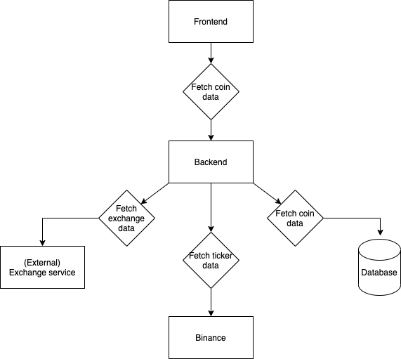

# README

A simple cryptocurrency ticker based on NodeJs.

## Pre-installed requisites

- Docker
- Node v12+

## Quick startup

Use `make install` to install the development environment. This will also migrate the database.

## Overview of the app

## Testing

To run the entire test suite, run `make test`

There are two types of tests: unit and acceptance tests.

#### Unit testing
[Jest](https://jestjs.io/) is the main framework to unit test this app. Run `make test-unit` to run the unit tests.

#### Acceptance tests
[Cypress](https://www.cypress.io/) runs the acceptance tests. Run `make test-acceptance` for the acceptance tests. 
